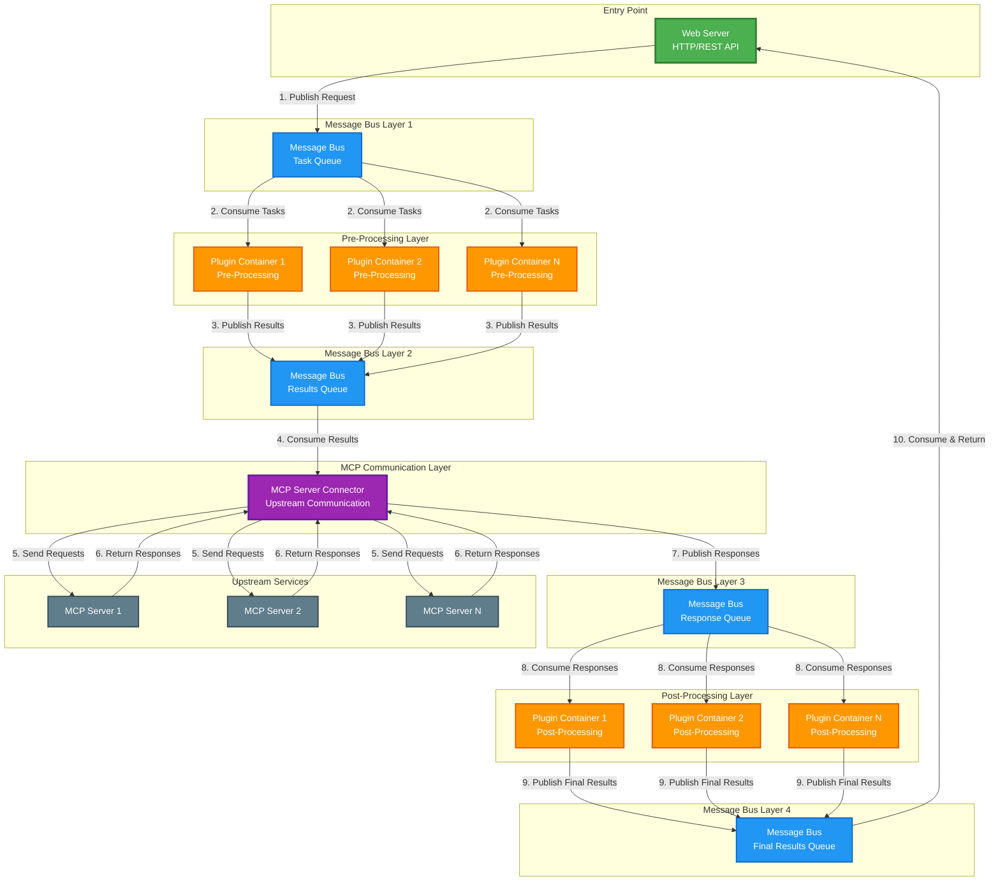

# MCP Gateway High-Level Architecture

## Architecture Components

### 1. Web Server (Entry Point)
- **Role**: Receives incoming HTTP/REST API requests
- **Actions**: 
  - Validates requests
  - Publishes tasks to Message Bus 1
  - Receives final results from Message Bus 4
  - Returns responses to clients

### 2. Message Bus Layer 1 (Task Queue)
- **Role**: Distributes incoming tasks to pre-processing plugins
- **Pattern**: Pub/Sub or Work Queue
- **Consumers**: Plugin Containers (Pre-Processing)

### 3. Pre-Processing Plugin Containers
- **Role**: Process and transform incoming requests
- **Scalability**: Multiple instances for horizontal scaling
- **Actions**:
  - Consume tasks from Message Bus 1
  - Apply pre-processing logic (validation, transformation, enrichment)
  - Publish results to Message Bus 2

### 4. Message Bus Layer 2 (Results Queue)
- **Role**: Aggregates pre-processed results
- **Consumer**: MCP Server Connector

### 5. MCP Server Connector
- **Role**: Communicates with upstream MCP servers
- **Actions**:
  - Consumes pre-processed tasks from Message Bus 2
  - Sends requests to upstream MCP servers
  - Receives responses from MCP servers
  - Publishes responses to Message Bus 3

### 6. Upstream MCP Servers
- **Role**: External MCP protocol servers
- **Examples**: Tool servers, resource servers, prompt servers

### 7. Message Bus Layer 3 (Response Queue)
- **Role**: Distributes MCP server responses to post-processing plugins
- **Consumers**: Plugin Containers (Post-Processing)

### 8. Post-Processing Plugin Containers
- **Role**: Process and transform MCP server responses
- **Scalability**: Multiple instances for horizontal scaling
- **Actions**:
  - Consume responses from Message Bus 3
  - Apply post-processing logic (filtering, formatting, aggregation)
  - Publish final results to Message Bus 4

### 9. Message Bus Layer 4 (Final Results Queue)
- **Role**: Delivers final processed results back to web server
- **Consumer**: Web Server

## Data Flow Summary

1. **Client → Web Server**: HTTP request
2. **Web Server → MB1**: Publish task
3. **MB1 → Pre-Processing Plugins**: Distribute tasks
4. **Pre-Processing Plugins → MB2**: Publish processed tasks
5. **MB2 → MCP Connector**: Consume processed tasks
6. **MCP Connector → Upstream MCP Servers**: Send MCP requests
7. **Upstream MCP Servers → MCP Connector**: Return MCP responses
8. **MCP Connector → MB3**: Publish responses
9. **MB3 → Post-Processing Plugins**: Distribute responses
10. **Post-Processing Plugins → MB4**: Publish final results
11. **MB4 → Web Server**: Consume final results
12. **Web Server → Client**: HTTP response

## Scalability & Resilience

- **Horizontal Scaling**: Plugin containers can scale independently
- **Decoupling**: Message buses decouple components
- **Fault Tolerance**: Failed plugins don't affect other components
- **Load Distribution**: Message buses distribute load across plugin instances
- **Async Processing**: Non-blocking message-based communication
