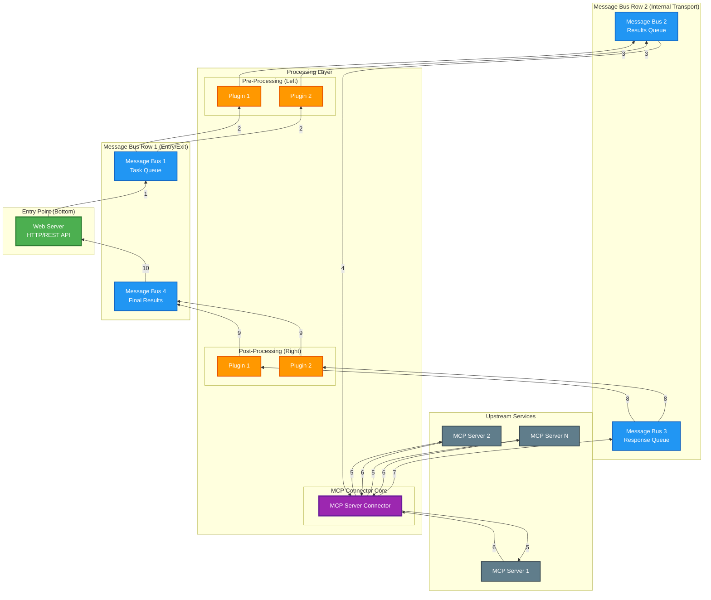

```mermaid
graph BT
    subgraph "Upstream Services"
        US1[MCP Server 1]
        US2[MCP Server 2]
        US3[MCP Server N]
    end

    subgraph "Message Bus Row 2 (Internal Transport)"
        direction LR
        MB2[Message Bus 2<br/>Results Queue]
        MB3[Message Bus 3<br/>Response Queue]
    end

    subgraph "Processing Layer"
        direction LR
        subgraph "Pre-Processing (Left)"
            PC1[Plugin 1]
            PC2[Plugin 2]
        end
        
        subgraph "MCP Connector Core"
            MCP[MCP Server Connector]
        end

        subgraph "Post-Processing (Right)"
            PP1[Plugin 1]
            PP2[Plugin 2]
        end
    end

    subgraph "Message Bus Row 1 (Entry/Exit)"
        direction LR
        MB1[Message Bus 1<br/>Task Queue]
        MB4[Message Bus 4<br/>Final Results]
    end

    subgraph "Entry Point (Bottom)"
        WS[Web Server<br/>HTTP/REST API]
    end

    %% Request Flow (Going Up)
    WS -->|1| MB1
    MB1 -->|2| PC1 & PC2
    PC1 & PC2 -->|3| MB2
    MB2 -->|4| MCP
    MCP -->|5| US1 & US2 & US3

    %% Response Flow (Coming Down)
    US1 & US2 & US3 -->|6| MCP
    MCP -->|7| MB3
    MB3 -->|8| PP1 & PP2
    PP1 & PP2 -->|9| MB4
    MB4 -->|10| WS

    %% Styling
    classDef webServer fill:#4CAF50,stroke:#2E7D32,stroke-width:3px,color:#fff
    classDef messageBus fill:#2196F3,stroke:#1565C0,stroke-width:2px,color:#fff
    classDef plugin fill:#FF9800,stroke:#E65100,stroke-width:2px,color:#fff
    classDef mcp fill:#9C27B0,stroke:#6A1B9A,stroke-width:3px,color:#fff
    classDef upstream fill:#607D8B,stroke:#37474F,stroke-width:2px,color:#fff

    class WS webServer
    class MB1,MB2,MB3,MB4 messageBus
    class PC1,PC2,PP1,PP2 plugin
    class MCP mcp
    class US1,US2,US3 upstream
```